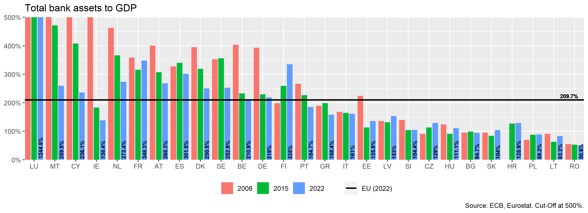
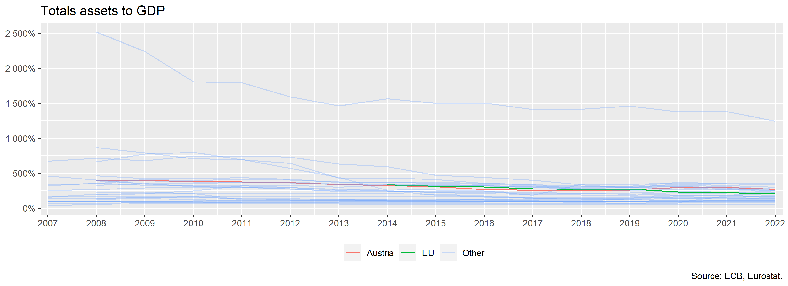
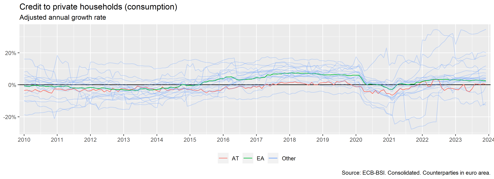
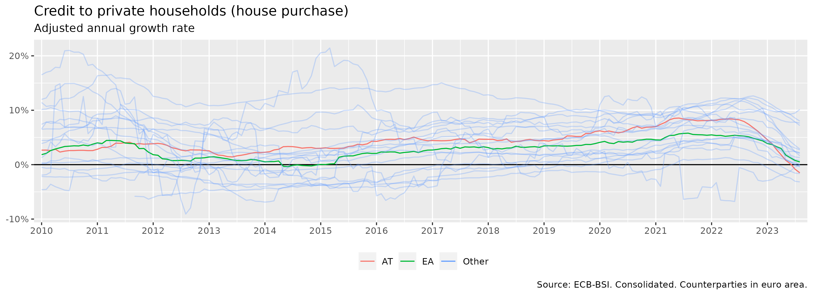
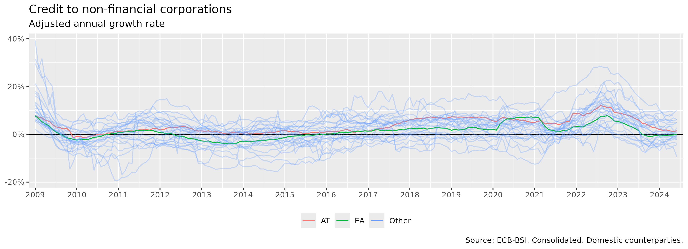
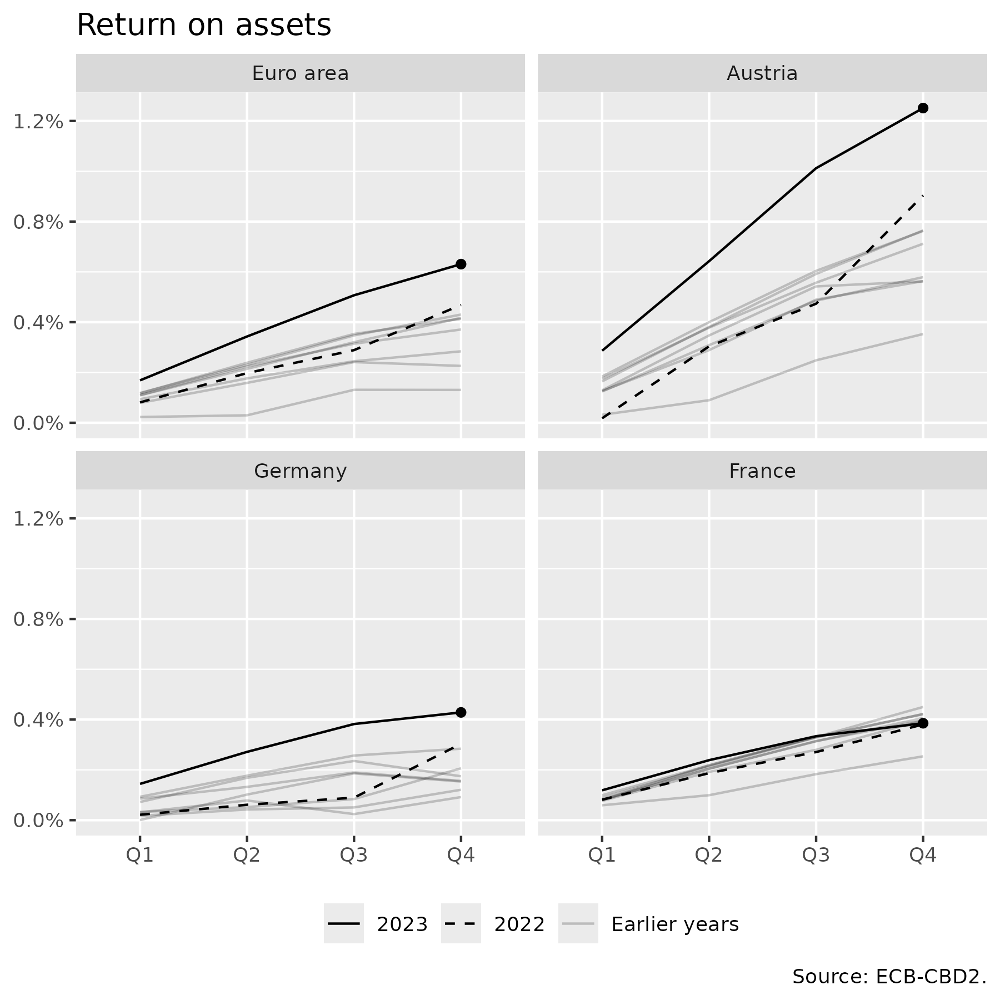
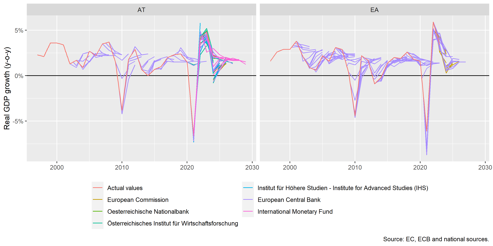
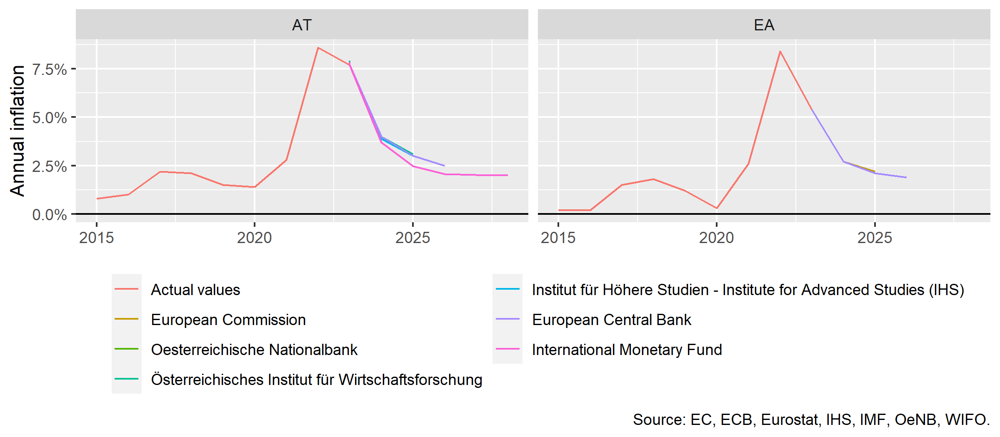
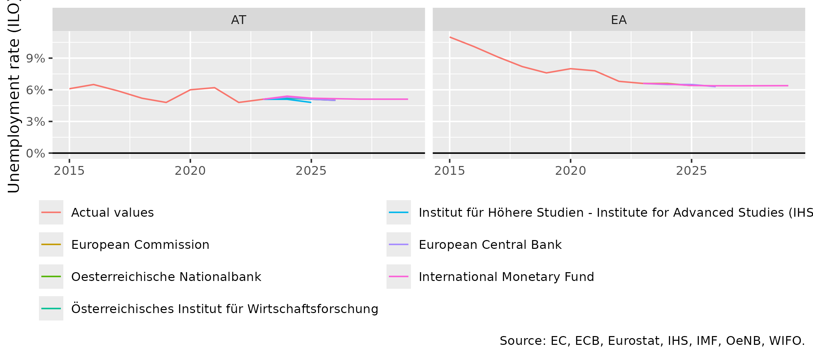

Collection of charts
================

This page can be considered a catalogue with all the charts, for which
code is available in subfolder [scripts](/scripts). The name to the top
left of a chart corresponds to the filename of the respective script.

bank_assets_to_gdp_bar_chart.pngbank_assets_to_gdp_line_chart.pngbank_household_consumption_credit_growth_line_chart.pngbank_household_rre_credit_growth_line_chart.pngbank_interest_rate.pngbank_nfc_credit_growth_line_chart.pngbank_return_on_assets.pngcentral_bank_policy_rates.pngcredit_new_by_sector.pngcredit_stock_composition.pnggdp_growth_medusa.pnggdp_growth_projections_for_eu_countries.pnginflation_components_for_ea_countries.pnginflation_projections_for_eu_countries.pngrre_price_growth_for_eu_countries.pngrre_rent_growth_for_eu_countries.pngunemployment_projections_for_eu_countries.png
